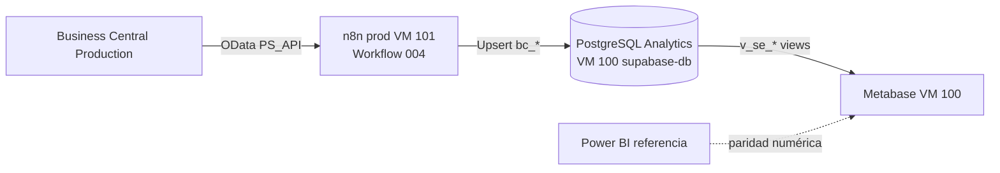

# Guía completa — Analytics BC + Metabase (Seguimiento Económico)

**Última actualización:** 2026-07-07  
**Estado:** Producción operativa con paridad KPI PSI 2026 vs Power BI

Documento de referencia único: qué tenemos, dónde vive cada cosa y cómo funciona el flujo de datos.

---

## 1. Resumen ejecutivo

| Pregunta | Respuesta |
|----------|-----------|
| ¿Para qué sirve? | Réplica de datos BC para **Metabase** (informe *Seguimiento Económico*, paridad con Power BI) |
| ¿La app Timesheet/Gastos la usa? | **No** — BD Analytics es solo reporting |
| ¿De dónde salen los datos? | **Business Central Production** vía workflow n8n **004** |
| ¿Dónde está Metabase? | VM **100** — `http://192.168.36.100:3000/` |
| ¿Dónde está PostgreSQL Analytics? | VM **100** — `192.168.36.100:5433` (contenedor `supabase-db`) |
| ¿Dónde corre el sync? | VM **101** — `https://apps.powersolution.es/n8n/` (contenedor `n8n-prod`) |

**Empresas sincronizadas:**

| Slug webhook | Nombre en BD | BC company ID |
|--------------|--------------|---------------|
| `psi` | Power Solution Iberia SL | `ca9dc1bf-54ee-ed11-884a-000d3a455d5b` |
| `pslab` | PS LAB CONSULTING SL | `656f8f0e-2bf4-ed11-8848-000d3a4baf18` |

---

## 2. Arquitectura



**Regla de oro:** el JSON canónico del workflow está en **power-solution-apps**; n8n prod es la instancia de ejecución. **No usar** n8n en VM 100 (retirado 2026-07-07).

---

## 3. Repositorios y responsabilidades

| Repo | Contenido |
|------|-----------|
| **power-solution-apps** | Workflow `004_sync_bc_to_analytics.json`, migraciones `ANALYTICS DB ONLY`, scripts `apply-analytics-migration.sh` |
| **metabase-analytics** (este) | Spec PBI, exports Metabase, documentación de dashboards |
| **power-solution-docs** | Docs compartidas (submódulo) |

---

## 4. Base de datos Analytics (VM 100)

### 4.1 Tablas de datos (`bc_*`) — 18 tablas

Todas prefijadas con `bc_` desde migración `20260627120001_rename_bc_tables_analytics.sql`.

| Tabla | Origen BC (API 004) | Modo sync | Descripción |
|-------|---------------------|-----------|-------------|
| `bc_resource` | Recursos | Incremental | Empleados/recursos con email y departamento |
| `bc_ps_year` | PS_Years | Full | Años fiscales PS |
| `bc_job` | Proyectos | Incremental | Maestro proyectos |
| `bc_job_team` | EquipoProyectos | Incremental | Equipo por proyecto |
| `bc_job_task` | ProyectosTareas | Incremental | Tareas de proyecto |
| `bc_responsibility_center` | CentrosDeResponsabilidad | Incremental | Centros de responsabilidad |
| `bc_user_configuration` | ConfiguracionUsuarios | Incremental | Config usuarios BC |
| `bc_technology` | Tecnologias | Incremental | Dimensión tecnología |
| `bc_typology` | Tipologias | Incremental | Dimensión tipología |
| `bc_department` | Departamentos | Incremental | Dimensión departamento |
| `bc_job_ledger_entry_month` | MovimientosProyectosMes | Full | Movimientos reales agregados por mes |
| `bc_job_planning_line` | PlanificacionMes | Full | Planificación por mes/línea |
| `bc_expediente_mes` | ExpedienteMes | Full | Expedientes planificados |
| `bc_meses_cerrados` | MesesCerrados | Full | Meses cerrados por proyecto |
| `bc_objectives_by_department` | ObjectivesByDepartaments | Full | Objetivos anuales por dpto |
| `bc_historico_planificacion_mes` | HistoricoPlanificacionMes | Full | Histórico planificación cerrada |
| `bc_dias_imputacion` | DiasdeImputacion | Full | Calendario imputable |
| `bc_job_ledger_entry` | *(legacy)* | — | **Vacía** — el sync usa `bc_job_ledger_entry_month` |

**Tablas operativas (no BC):**

| Tabla | Uso |
|-------|-----|
| `sync_state` | Puntero incremental por `(company_name, entity)` |
| `sync_executions` | Log de ejecuciones del webhook 004 |

**Eliminado 2026-07-07 (legacy Imixs, no usado por Metabase):**  
`workflow_*`, `login_company`, `companys`, `role_type_permissions`, `v_user_roles_summary`.

### 4.2 Vistas Metabase (`v_se_*`) — 13 vistas

Capa semántica equivalente al modelo Power BI. Definidas en migraciones `20260702180000_*`, `20260702200000_*` y fixes julio 2026.

| Vista | Rol PBI | Fuente principal |
|-------|---------|------------------|
| `v_se_dim_empresas` | Slicer Empresas | `bc_job` (distinct `company_name`) |
| `v_se_dim_anos` | Slicer Años | `bc_job_planning_line` + `bc_ps_year` |
| `v_se_dim_departamentos` | Slicer Departamentos | `bc_department` |
| `v_se_lineas_planificacion` | Líneas planificación | `bc_job_planning_line` |
| `v_se_lineas_movimientos` | Líneas movimientos | `bc_job_ledger_entry_month` |
| `v_se_lineas_expedientes` | Líneas expedientes | `bc_expediente_mes` |
| `v_se_lineas_meses_cerrados` | Meses cerrados | `bc_meses_cerrados` |
| `v_se_historico_planificacion` | Histórico | `bc_historico_planificacion_mes` |
| `v_se_objectives` | Objetivos | `bc_objectives_by_department` |
| `v_se_facturacion` | Tabla central UNION | Plan + mov + exped + meses cerrados |
| `v_se_kpi_cards` | Tarjetas KPI Resumen | Objetivos + `v_se_facturacion` tipo **P** |
| `v_se_resumen_mensual` | Acumulados mensuales | Agregación sobre facturación |
| `v_se_facturacion_recursos` | Mano de obra | Subconjunto recursos |

**Metabase debe consultar solo `v_se_*`**, no `bc_*` directamente (salvo debugging).

---

## 5. Workflow 004 — cómo sincroniza

**Archivo:** `power-solution-apps/apps/timesheet/src/workflows/004_sync_bc_to_analytics.json`  
**ID n8n prod:** `d1f7647e114a486e`  
**Webhook:**

```bash
curl -sS -m 900 -X POST \
  'https://apps.powersolution.es/n8n/webhook/sync-bc-to-analytics?company=psi'

curl -sS -m 900 -X POST \
  'https://apps.powersolution.es/n8n/webhook/sync-bc-to-analytics?company=pslab'
```

**BC:** `BC_ENVIRONMENT=Production` en n8n-prod.

### 5.1 Flujo por entidad

```text
Webhook (?company=psi|pslab)
  → Set Company (mapa slug → companyName + companyId)
  → Get sync_state ALL
  → Build sync_state map (default 1900-01-01 si falta fila)
  → [por cada entidad en paralelo]
      Ensure sync_state → BC API → Transform → Upsert Postgres
      → Compute now ISO → Update sync_state (solo si hubo upserts OK)
  → Compute Execution Summary → Response JSON
```

### 5.2 Incremental vs full

| Modo | Entidades | BC API |
|------|-----------|--------|
| **Incremental** | resource, job, job_team, job_task, centers, user_configuration, technologies, typologies, departments | `$filter=lastModifiedDateTime ge {sync_state}` |
| **Full snapshot** | ps_year, movimientos mes, planificación, expediente, meses cerrados, objetivos, histórico, días imputación | Sin filtro fecha — recarga completa cada sync |

### 5.3 Paginación OData (crítico)

**Todos los nodos `BC API - *`** (17 nodos) usan paginación anidada `@odata.nextLink`:

```json
"pagination": {
  "pagination": {
    "paginationMode": "responseContainsNextURL",
    "nextURL": "={{ $response.body['@odata.nextLink'] }}",
    "paginationCompleteWhen": "other",
    "completeExpression": "={{ !$response.body['@odata.nextLink'] }}"
  }
}
```

Sin esto, BC solo devuelve la primera página (~5.000 filas) y los KPI quedan incompletos.

### 5.4 Filtros de negocio (igual que workflow 001)

- Proyectos **PP** / **PY** → excluidos en transform
- `resource` → requiere email con `@` y departamento
- `job` → status en lista válida; description y departamento obligatorios
- Upserts con `EXISTS` sobre `bc_job` / `bc_resource` donde aplica

### 5.5 Borrados

El 004 **no elimina** filas huérfanas. Borrados maestros BC → workflow **017** (`POST /webhook/bc-master-deleted`).

---

## 6. KPIs y paridad Power BI

### 6.1 Medida PBI replicada

| KPI | Medida Analytics | Filtro |
|-----|------------------|--------|
| Planificación actual (facturación) | `SUM(facturado)` en `v_se_facturacion` | `tipo = 'P'` |
| Real (facturación) | `SUM(facturado)` en `v_se_facturacion` | `tipo = 'R'` |
| Tarjeta resumen | `v_se_kpi_cards.plan_facturacion` | Agrega tipo P + objetivos |

Migración clave: `20260707190000_analytics_planificado_kpi_tipo_p.sql`

### 6.2 Referencia PSI 2026 (validado 2026-07-07)

| Métrica | Power BI | Analytics | Estado |
|---------|----------|-----------|--------|
| Real facturación | 2.284.579 € | 2.284.579 € | ✅ |
| Plan facturación | 4.193.215 € | 4.193.215 € | ✅ |
| Filas plan 2026 | ~24.199 | 24.199 | ✅ |
| Meses cerrados PSI | ~11.004 | 11.004 | ✅ |

### 6.3 SQL de validación

```sql
-- KPI tarjetas
SELECT * FROM v_se_kpi_cards
WHERE empresa = 'Power Solution Iberia SL' AND ano = 2026;

-- Desglose Real vs Plan
SELECT tipo, ROUND(SUM(facturado)::numeric, 0) AS total
FROM v_se_facturacion
WHERE empresa = 'Power Solution Iberia SL' AND year = 2026
GROUP BY tipo;

-- Conteos sync
SELECT company_name, COUNT(*) AS plan_2026
FROM bc_job_planning_line
WHERE year = 2026
GROUP BY 1;
```

---

## 7. Operaciones

### 7.1 Ejecutar sync manual

```bash
curl -sS -m 900 -X POST \
  'https://apps.powersolution.es/n8n/webhook/sync-bc-to-analytics?company=psi'
```

Duración típica: **PSI ~4–5 min**, **PSLAB ~1–2 min**.

### 7.2 Actualizar workflow en n8n prod

Desde `power-solution-apps`:

```bash
# Opción A: API (requiere N8N_API_KEY_PRODUCTION)
N8N_ENV=production ./apps/timesheet/src/workflows/update_workflow_n8n.sh \
  apps/timesheet/src/workflows/004_sync_bc_to_analytics.json

# Opción B: SQLite hotfix (ver N8N_GUIDE.md PASO 2.5 remapeo credenciales)
./scripts/apply-analytics-migration.sh  # solo SQL; para n8n ver docs/ACTUALIZAR_WORKFLOW_004.md
```

**Prod:** workflow ID `d1f7647e114a486e`, DB `/var/lib/docker/volumes/n8n_n8n_data_clean/_data/database.sqlite`

### 7.3 Aplicar migraciones SQL Analytics

```bash
cd power-solution-apps

# Producción VM 100
./scripts/apply-analytics-migration.sh supabase/migrations/<archivo>.sql

# DEV VM 102
ANALYTICS_DB_HOST=192.168.36.102 \
ANALYTICS_DB_CONTAINER=supabase-analytics-db-dev \
  ./scripts/apply-analytics-migration.sh supabase/migrations/<archivo>.sql
```

⚠️ Migraciones con cabecera **`ANALYTICS DB ONLY`** — **no** usar `run-migrations.sh` de Timesheet.

### 7.4 Resync completo (prueba o recuperación)

```sql
-- 1) Vaciar datos BC
TRUNCATE TABLE
  bc_expediente_mes, bc_historico_planificacion_mes, bc_job_ledger_entry_month,
  bc_job_planning_line, bc_job_task, bc_job_team, bc_meses_cerrados,
  bc_objectives_by_department, bc_dias_imputacion, bc_job, bc_resource,
  bc_responsibility_center, bc_user_configuration, bc_technology,
  bc_typology, bc_department, bc_ps_year, bc_job_ledger_entry
CASCADE;

-- 2) Reset incremental
UPDATE public.sync_state SET last_sync_at = '1900-01-01'::timestamptz;
```

Luego sync PSI + PSLAB vía webhook. Validar KPIs con SQL §6.3.

---

## 8. Migraciones relevantes (julio 2026)

| Migración | Propósito |
|-----------|-----------|
| `20260702180000_analytics_seguimiento_economico_views.sql` | Vistas base `v_se_*` |
| `20260702200000_analytics_seguimiento_economico_phase2_views.sql` | Fase 2 (expediente, histórico, objetivos) |
| `20260707164000_analytics_planificacion_match_pbi_m.sql` | Planificación alineada PBI |
| `20260707161500_analytics_expedientes_match_pbi_m.sql` | Expedientes alineados PBI |
| `20260707180000_analytics_meses_cerrados_match_pbi_m.sql` | Meses cerrados |
| `20260707173000_analytics_facturacion_table_match_pbi_m.sql` | UNION facturación |
| `20260707190000_analytics_planificado_kpi_tipo_p.sql` | KPI plan = tipo P |
| `20260707190500_analytics_planificacion_dept_coalesce.sql` | Dept COALESCE línea/proyecto |
| `20260525180000_drop_analytics_imixs_only_tables.sql` | Limpieza Imixs |
| `20260707194500_analytics_drop_workflow_roles_legacy.sql` | Drop workflow_roles |
| `20260707195000_analytics_recreate_v_se_dim_empresas.sql` | Dim empresas desde bc_job |

---

## 9. Troubleshooting

| Síntoma | Causa probable | Acción |
|---------|----------------|--------|
| KPI plan ~7 M€ en lugar de ~4,2 M€ | Vista KPI antigua (híbrido meses cerrados) | Aplicar `20260707190000_analytics_planificado_kpi_tipo_p.sql` |
| KPI plan bajo (~3,4 M€) | Paginación rota en PlanificacionMes | Verificar paginación anidada en JSON 004; resync full |
| Incremental no trae datos | `sync_state` reciente sin filas nuevas en BC | Reset `last_sync_at` a 1900-01-01 + sync |
| Metabase sin empresas en slicer | `v_se_dim_empresas` caída | Aplicar `20260707195000_analytics_recreate_v_se_dim_empresas.sql` |
| Sync OAuth error | n8n incorrecto (VM 100) | Usar solo apps.powersolution.es/n8n (VM 101) |

---

## 10. Documentación relacionada

| Documento | Ubicación |
|-----------|-----------|
| Actualizar workflow 004 | [ACTUALIZAR_WORKFLOW_004.md](./ACTUALIZAR_WORKFLOW_004.md) |
| Seguimiento Económico (fases PBI) | [seguimiento-economico/README.md](./seguimiento-economico/README.md) |
| Análisis técnico workflow 004 | `power-solution-apps/.../WORKFLOW_004_ANALYSIS.md` |
| Reparto BD principal vs Analytics | `power-solution-apps/docs/architecture/DATABASES_SPLIT.md` |
| Guía n8n | `power-solution-apps/docs/shared/n8n/N8N_GUIDE.md` |

---

**Mantenimiento:** tras cada cambio en views SQL o workflow 004 → migración en git → aplicar en prod → sync → validar §6.3 → actualizar esta guía si cambia el comportamiento.
